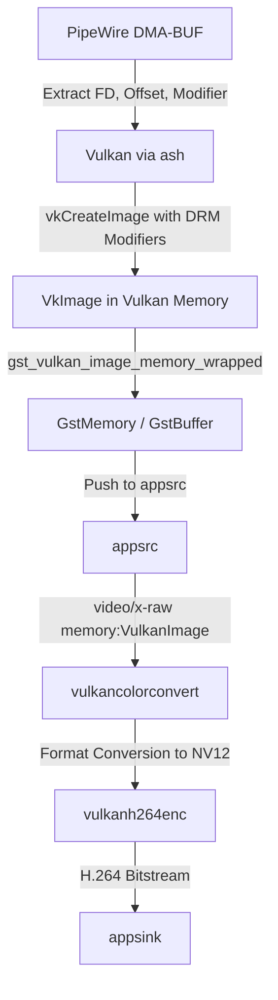

# Vulkan Video Encoding Plan

This document outlines the plan to implement a GPU-accelerated video encoding pipeline using Vulkan and GStreamer, bypassing the NVIDIA EGL/OpenGL paths.

## Background & Constraints
1. **Host Limitation (No Direct CUDA DMA-BUF Import)**: 
   Direct DMA-BUF fd import into CUDA (via `cuImportExternalMemory` with `CU_EXTERNAL_MEMORY_HANDLE_TYPE_DMABUF_FD`) requires hardware/driver-level support. We verified using `cuDeviceGetAttribute` checking for `CU_DEVICE_ATTRIBUTE_DMA_BUF_SUPPORTED` on the host GPU (NVIDIA Turing architecture, RTX 2080) that it returns `0` (false). Direct CUDA import of DMA-BUF is only supported on Ampere (RTX 30-series) and newer hardware.
2. **KWin Output**: KWin's virtual output only exports block-linear/tiled DMA-BUFs. Negotiating linear DMA-BUF is not possible without KWin falling back to system memory (`MemPtr`).
3. **GStreamer vulkanupload Limitation**: GStreamer's `vulkanupload` element does not support the `DMA_DRM` caps/format on this system (it cannot parse tiling modifiers or negotiate zero-copy import for `DMA_DRM`).
4. **Vulkan Video Complexity**: Creating a raw H.264 Vulkan Video encoder using `ash` from scratch is highly complex due to manual SPS/PPS generation and reference picture list tracking.

## Solution: Native Vulkan Import & GStreamer Video Pipeline
Instead of using `vulkanupload`, we will write native `ash` code to import the tiled DMA-BUF from PipeWire directly into Vulkan, and wrap it into a GStreamer `VulkanImage` buffer to pass it downstream to `vulkancolorconvert` and `vulkanh264enc`.



## Step-by-Step Implementation

### Step 1: Add Dependencies
Add `gstreamer-vulkan = "0.21"` and `ash` to the project's dependencies:
- Update [Cargo.toml](file:///home/klimek/src/redfog/crates/kwin-capture/Cargo.toml) to include:
  ```toml
  gstreamer-vulkan = "0.21"
  ash = "0.37" # Or appropriate matching version
  ```

### Step 2: Implement Vulkan Image Import
Using `ash`, import the DMA-BUF file descriptor:
1. Enable `VK_EXT_external_memory_dma_buf` and `VK_EXT_image_drm_format_modifier` device extensions.
2. Configure `VkImageDrmFormatModifierExplicitCreateInfoEXT` with:
   - DRM modifier (from KWin's captured frame).
   - Plane layouts (row pitch, offset).
3. Create a `VkImage` using `VkExternalMemoryImageCreateInfo` with `VK_EXTERNAL_MEMORY_HANDLE_TYPE_DMA_BUF_BIT_EXT`.
4. Retrieve the memory requirements and allocate/bind `VkDeviceMemory` using `VkImportMemoryFdInfoKHR`.

### Step 3: Wrap in GStreamer Memory
Wrap the imported `VkImage` using the GStreamer Vulkan API:
- Obtain the GStreamer Vulkan Device (`GstVulkanDevice`).
- Call `gst_vulkan_image_memory_wrapped` to wrap the `VkImage` into a `GstMemory`.
- Construct a `GstBuffer`, append the wrapped memory, and add `GstVideoMeta`.

### Step 4: Configure GStreamer Pipeline
Set the `appsrc` caps to:
```text
video/x-raw(memory:VulkanImage), format=BGRA, width=1280, height=720, framerate=0/1
```
And link downstream elements:
```text
appsrc ! vulkancolorconvert ! vulkanh264enc name=encoder ! video/x-h264,stream-format=byte-stream,alignment=au ! appsink name=sink
```
Because the buffer is already a Vulkan image when exiting `appsrc`, no upload element is needed.
